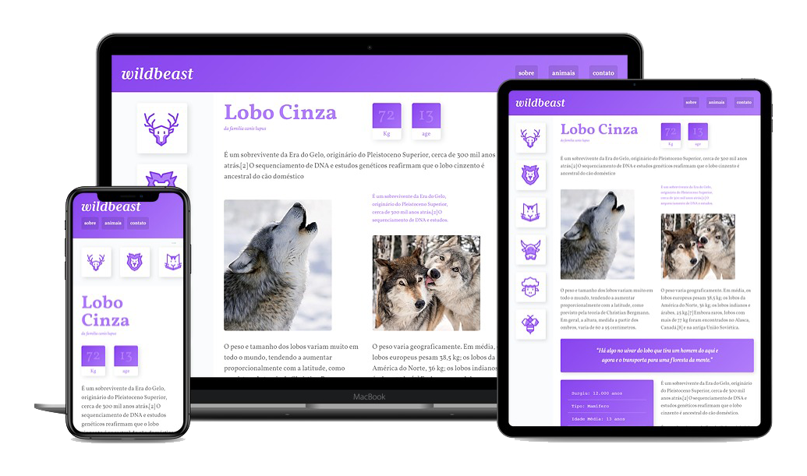
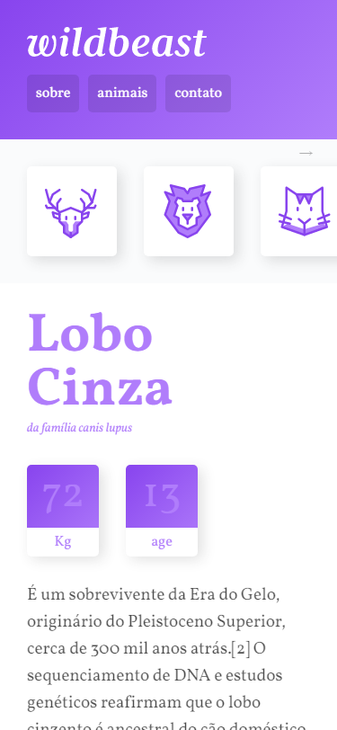
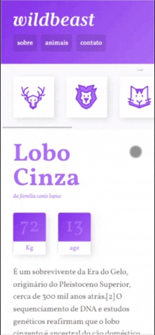
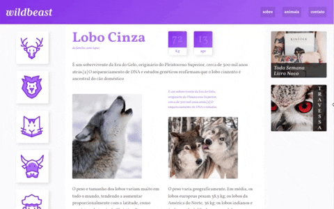

<p align="center">
  

  
  
  <a href="https://github.com/ludmillalopes/wildbeast/commits/main">
    
  </a>
    
  
</p>

<p>
  
</p>

<p align="center">Projeto desenvolvido com a finalidade de aplicar conhecimentos adquiridos no curso de CSS Grid Layout da Origamid.</p>

<h4 align="center">🚧  Wildbeast 🐺 Em Construção 🚀 🚧</h4>

<p align="center">
 <a href="#-sobre-o-projeto">Sobre</a> •
 <a href="#-funcionalidades">Funcionalidades</a> •
 <a href="#-layout">Layout</a> • 
 <a href="#-como-executar-o-projeto">Como executar</a> • 
 <a href="#-tecnologias">Tecnologias</a> • 
 <a href="#-autor">Autor</a> • 
 <a href="#-licença">Licença</a>
</p>


## 💻 Sobre o projeto

Wildbeast é um projeto desenvolvido pela [Origamid](https://www.origamid.com) com a finalidade de aplicar os conhecimentos adquiridos no curso de CSS Grid Layout.

Trata-se da página inicial para o site sobre animais. O projeto apresentado no curso conta com a página desenvolvida em layout responsivo, utilizando as propriedades do CSS Grid Layout. Suas funcionalidades são apenas representativas, pois o objetivo do curso é o aprendizado de CSS Grid Layout

A intenção é continuar o desenvolvimento do site tornando-o funcional.

---

## ⚙️ Funcionalidades

- [x] Uso de layout responsivo e CSS Grid Layout no desenvolvimendo do código para fixação de conteúdo
- [x] Usuários podem conhecer informações e curiosidades a respeito de espécies de animais cadastrados
- [ ] Apresenta informações sobre cada espécie de animal inicialmente sugerido no menu
  - [x] Lobo Cinza
  - [ ] Cervo
  - [ ] Leão
  - [ ] Gato
  - [ ] Boi
  - [ ] Ovelha
  - [ ] Abelha
    - imagens ilustrativas
    - peso e média de idade que sobrevivem
    - ficha de dados
- [ ] Acrescentar Lobo Cinza no menu de espécies animais
- [ ] Apresentar páginas:
  - [ ] Sobre
  - [ ] Animais
  - [ ] Contato

---

## 🎨 Layout

<p align="center">
	
</p>


### 📱 Mobile

<p align="center">
  

  
</p>

### 💻 Web

<p align="center">
  

  
</p>

---

## 🚀 Como executar o projeto

### __Pré-requisitos__

Antes de começar, você precisa ter instalado em sua máquina as seguintes ferramentas:
* [Git](https://git-scm.com)
* [VSCode](https://code.visualstudio.com/), ou o editor de código de sua preferência

#### __Rodando a aplicação web (Front End)__

```bash

# Clone este repositório
$ git clone https://github.com/ludmillalopes/wildbeast.git

# Acesse o pasta do projeto no seu terminal/cmd
$ cd wildbeast

# Abra o arquivo index.html
$ $ start index.html

```

---

## ⚒️ Tecnologias

As seguintes ferramentas foram usadas na construção do projeto:

- [x] __[HTML](https://developer.mozilla.org/pt-BR/docs/Web/HTML)__
- [x] __[CSS](https://developer.mozilla.org/pt-BR/docs/Web/CSS)__
- __[CSS Grid Layout](https://developer.mozilla.org/pt-BR/docs/Web/CSS/CSS_Grid_Layout)__
- [ ] __[JavaScript](https://www.javascript.com)__ 

---

## 💪 Como contribuir para o projeto

1. Faça um **fork** do projeto.
2. Crie uma nova branch com as suas alterações: `git checkout -b my-feature`
3. Salve as alterações e crie uma mensagem de commit contando o que você fez: `git commit -m "feature: My new feature"`
4. Envie as suas alterações: `git push origin my-feature`

---

## 👩‍💻 Autor

<a href="https://github.com/ludmillalopes">
  
 <br />
 <b>Ludmilla Lopes 🚀</b>
</a>

[](https://www.linkedin.com/in/ludmillalopes/) 
[](mailto:ludmilla.lopes@hotmail.com)

---

## 📝 Licença

Esse projeto está sob licença [MIT](https://github.com/ludmillalopes/wildbeast/blob/add-license-1/LICENSE).

Feito com ❤️ por Ludmilla Lopes 👋 [Entre em contato!](https://www.linkedin.com/in/ludmillalopes/)